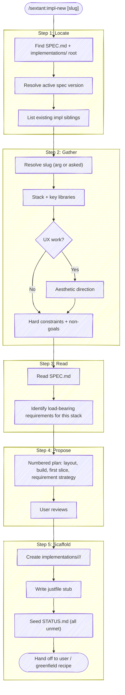

# Impl New Skill

You are scaffolding a new candidate implementation in a spec-driven project. The candidate's job is to stress-test the spec — to surface gaps, contradictions, and overly prescriptive requirements by being built against them. Treat it as an instrumented experiment, not a competitor or a draft of "the real thing."



## Step 1: Locate the spec-driven tree

Find the active spec and the `implementations/` root. Check in order:

1. Justfile `spec`, `current`, or `CURRENT_SPEC_VERSION` variables — these point at the active spec version.
2. `spec/<version>/SPEC.md` — versioned spec layout (the canonical spec-driven shape).
3. `SPEC.md` at the repo root — unversioned, older or simpler projects.
4. `vnext/`, `exploration/`, `migration/` subfolders — common nested setups inside existing repos.

If no SPEC.md is found, **stop** and ask. Don't scaffold an implementation tree before there's a contract to build against.

Resolve the implementations root from the spec location:

- If spec lives at `spec/<v>/SPEC.md`, implementations live at `implementations/<v>/`.
- If spec lives at the root, ask whether to scaffold `implementations/v1/` or just `implementations/`.
- If the project lives inside a subfolder (`vnext/spec/<v>/...`), all paths are relative to that subfolder.

Once located, **list existing sibling implementations** (`implementations/<v>/*/`) so the user and you both know what number this candidate is and what stacks are already covered.

## Step 2: Gather inputs conversationally

The goal is to make the user's choices explicit before scaffolding, so the implementation starts with intentional constraints rather than convention defaults.

### Slug

The skill's positional argument is the slug. If absent, ask. Naming convention: `<n>-<short-name>` where `<n>` is the next sequence number across existing siblings. Examples: `1-python`, `2-js`, `3-hybrid`, `4-rust`.

Validate the slug:

- Lowercase, kebab-case.
- Starts with the next sequence number — refuse to scaffold `2-x` if `1-y` already exists with no `2-*` siblings; suggest `3-x` (or whatever the next gap is).
- Doesn't collide with an existing sibling.

### Stack and key libraries

Ask the user to name:

- **Primary language and framework** — "Python + FastAPI", "TypeScript + Vite + React", "Go stdlib only", etc.
- **Key libraries that shape the architecture** — the ones whose choice constrains everything downstream. Database driver, UI framework, state management, HTTP client. Don't ask about every transitive dep — just the load-bearing ones.

If the user can't articulate a stack yet, present the existing siblings and suggest a deliberately different choice. The point of multiple implementations is breadth — don't build a second Python+FastAPI candidate when a JS or Go one would surface different blind spots.

### Aesthetic direction (UX work only)

**Skip this step for CLI tools, libraries, and headless services** — the spec dictates output format and there's no aesthetic to choose.

For UX-bearing work, ask for an explicit aesthetic anchor: "Pico CSS classless," "warm darkroom," "Swiss Neobrutalist," "iOS dark mode." This is the single biggest lever against AI-aesthetic convergence — without a deliberate direction, multiple UI implementations will drift toward the same "generic AI dashboard" look and stop being useful for comparison.

If you can't tell whether the work is UX-bearing, look at SPEC.md for keywords ("page", "render", "click", "view", "panel", "screen") or ask.

### Hard constraints and non-goals

Ask for:

- **Constraints to honor** — must-use libraries (e.g., "the team's existing ORM"), forbidden patterns (e.g., "no global state"), performance budgets (e.g., "render under 100ms"), platform targets.
- **Out-of-scope for this candidate** — what this implementation deliberately won't cover. The candidate doesn't have to address every requirement — sometimes the point is to test whether a subset feels right.

These are the spec deltas for this implementation. Capture them — they shape the plan in Step 4 and the seeded STATUS.md in Step 5.

## Step 3: Read SPEC.md

Read the full SPEC.md (or just the active version if multi-versioned). Build a working model of:

- **Categories and requirement counts** — `CM: 4`, `OP: 7`, etc.
- **The core contract** — the one or two ubiquitous requirements that anchor everything else (usually the first few entries; sometimes called out explicitly).
- **Load-bearing requirements for this stack** — requirements that the chosen stack will need explicit work to satisfy, versus requirements that fall out naturally. Example: in a JS+React implementation, `[OP-3] system shall render under 100ms` needs explicit work (memoization, virtualization); in a Go+stdlib HTTP server, the same requirement falls out of the stack.

This identification is the key value-add over the user just running `mkdir`. The plan in Step 4 builds on it.

## Step 4: Propose a plan

Present a numbered plan, ~6-10 items, that the user can review and edit before any files are touched. Cover:

1. **Directory layout** — what subdirs and entry-point files this implementation needs given the stack (e.g., `src/`, `tests/`, `package.json` + `tsconfig.json` for TS; `pyproject.toml` + `src/<name>/` for Python; etc.).
2. **Build / run / test commands** — what `just build`, `just run`, `just test` will invoke. Each implementation owns its own justfile.
3. **First slice to implement** — the core contract from SPEC.md, end-to-end. Resist the urge to scaffold ten requirements at once; the first slice should exercise the one invariant that the candidate's main job is to verify.
4. **Requirement coverage strategy** — for each category, which requirements likely fall out of the stack vs. need explicit work. Reference IDs explicitly.
5. **Out-of-scope acknowledgments** — restate what the user said this candidate deliberately won't cover, with the relevant requirement IDs (e.g., `FUT-1`, `FUT-3` deferred per user direction).
6. **Anti-port reminder** — do not copy from sibling implementations. If you need to look at one for inspiration, **stop** and consult the spec instead. The candidate's value comes from building from the spec, not from porting.

Present the plan, then **wait for sign-off**. If the user edits the plan, redo the relevant sections. If the user changes stack or constraints, loop back to Step 2 and gather again.

## Step 5: Scaffold

On sign-off, create:

```text
implementations/<v>/<slug>/
├── justfile         # build / run / test stubs
├── STATUS.md        # requirement coverage, all 'unmet' by default
└── (other entry-point files per Step 4's plan)
```

### `justfile`

Minimal stub — the user fills in the body during implementation. Three recipes at a minimum: `build`, `run`, `test`. Include a header comment naming the slug and the spec version it's built against:

```just
# implementations/<v>/<slug>/justfile
# Spec version: <v>
# Stack: <stack>

default:
    @just --list

build:
    # TODO

run:
    # TODO

test:
    # TODO
```

### `STATUS.md`

Seed with every non-FUT requirement ID from SPEC.md, each marked `unmet`. The user (and `/sextant:spec-audit`) will flip entries to `covered` / `partial` as implementation progresses.

```markdown
# STATUS — <slug>

**Spec:** spec/<v>/SPEC.md
**Stack:** <stack from Step 2>
**Constraints:** <constraints from Step 2>
**Out of scope:** <FUT IDs and any user-declared deferrals from Step 2>

## Coverage

| ID    | Requirement (abbreviated) | Status | Location |
|-------|---------------------------|--------|----------|
| CM-01 | <text>                    | unmet  | —        |
| CM-02 | <text>                    | unmet  | —        |
| ...   | ...                       | ...    | ...      |
```

Use **abbreviated** requirement text in the table (first ~10-12 words) — full text lives in SPEC.md, the table is for tracking, not for re-reading.

### Hand off

Report back to the user:

```text
Scaffolded implementations/<v>/<slug>/:
  → justfile stub (build/run/test)
  → STATUS.md with N unmet requirements seeded from spec/<v>/SPEC.md

Next: start implementing the first slice — the core contract. See your plan, item 3.
Consider invoking /recipe greenfield for the implementation phase.
```

Do not start implementing yourself. The skill's job is to scaffold and frame the work; the user (or a fresh greenfield session) drives the build.

## Anti-Patterns

- **Scaffolding without a spec** — if SPEC.md doesn't exist or doesn't have requirement IDs, stop and ask the user to draft one first (`/sextant:spec-req new` can help). An implementation without a spec to verify against isn't a candidate, it's just code.
- **Skipping the conversational gather** — slug + "default Python project" is not enough. The plan in Step 4 depends on stack + constraints; jumping straight to scaffolding produces a generic skeleton that gets thrown away the moment the user tries to add their actual stack choices.
- **Porting from siblings** — if existing implementations have files, do not copy them. The candidate's job is to build from the spec, not to recapitulate prior work. If a sibling solved an interesting problem worth referencing, note it in the plan for the user — don't pre-seed code from it.
- **Filling STATUS.md with optimistic guesses** — every requirement starts `unmet`. Resist marking entries `covered` based on stack convention ("React will handle accessibility") — let `/sextant:spec-audit` verify after the implementation exists.
- **Numbering off-by-one** — `1-python` already exists, user asks for `1-rust`. Refuse and propose the next available number, or ask whether to retire `1-python` first.

## Related

- [`/sextant:spec-req`](../spec-req/SKILL.md) — useful before scaffolding if SPEC.md is missing requirement IDs or needs a new requirement captured first.
- [`/sextant:spec-audit`](../spec-audit/SKILL.md) — run after the first slice to verify the candidate is on track. The seeded STATUS.md is the input the audit reads against.
- [`/sextant:impl-select`](../impl-select/SKILL.md) — the inverse operation. When one candidate has earned the right to be the only one, `impl-select` retires the others and flattens the winner to the repo root.
