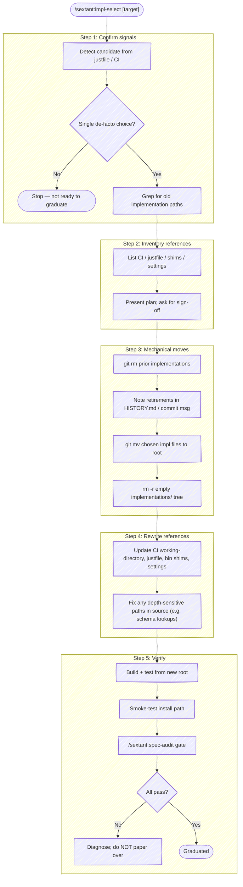

# Impl Select Skill

You are graduating a spec-driven project from multi-implementation exploration to a single committed implementation. This is the graduation phase of a spec-driven workflow. It is a **one-way** move — re-introducing parallel implementations later is more expensive than living with the indirection a while longer, so confirm the signals before starting.



## When to Use

- One implementation in `implementations/<version>/<n>-<name>/` is the de-facto choice — it's what users install, what CI builds, what the agent integration targets.
- The other implementations are inactive — no commits in weeks, no one referencing them.
- The spec is stable enough to revise in place; you're not actively versioning.
- The `implementations/` indirection is now drag, not optionality.

## When NOT to Use

- Multiple implementations are still earning their keep (different deployment targets, ongoing comparison).
- The spec is still revealing new gaps when you use the chosen implementation — finish exploration first.
- You're tempted to graduate to "clean things up" but no implementation has actually won. The smell is sunk-cost dressed as housekeeping. Wait.

## Behavior

### Step 1: Confirm signals

Detect the candidate implementation and confirm it's the right one to select:

1. **Detect from justfile** — look for `impl := "<n>-<name>"` or `current := "<n>-<name>"`. That's the active one.
2. **Detect from CI** — check `.github/workflows/*.yml` (or `.gitlab-ci.yml`) for `working-directory: implementations/<version>/<n>-<name>` or path-scoped `cache-dependency-path`.
3. **Detect from `bin/`** — any shim referencing an implementation path.
4. **Confirm with the user** — present what you found and ask: "Select `<n>-<name>` and flatten it to the root, retire the others?"

If the candidate is ambiguous, ask. Do not guess.

### Step 2: Inventory references

Run a global search for the old paths so nothing is missed:

```bash
grep -rn "implementations/" --include="*.md" --include="*.sh" --include="*.json" --include="*.ts" --include="*.js" --include="*.py" --include="*.yml" --include="*.yaml" --include="justfile" --include="Makefile" .
```

Build a list of files that reference `implementations/`. Present the list to the user as "files that will need rewrites" before touching anything.

### Step 3: Mechanical moves

In a single coherent commit (or PR):

1. **Retire prior implementations** — for each non-graduated `implementations/<version>/<other>/`, run `git rm -r`. Drop a brief note in `implementations/HISTORY.md` (or in the commit message) saying what each contributed and why it was retired. Frame the contribution positively — these implementations did their job by surfacing spec problems. Avoid words like "losers" or "failed" — they were instrumented experiments, not competitors.

2. **Move the chosen implementation to root** — use `git mv` to preserve history:
   - `git mv implementations/<v>/<n>-<name>/{src,package.json,package-lock.json,tsconfig.json,.gitignore,...} <root>`
   - Build artifacts (`dist/`, `node_modules/`, etc.) are gitignored — don't `git mv` them; they'll be regenerated.

3. **Delete the empty tree** — `rmdir implementations/<v>/<n>-<name> implementations/<v> implementations` once everything is moved.

### Step 4: Rewrite references

Touch every file from the inventory:

- **CI workflow** — drop `working-directory:` and any `cache-dependency-path:` subpath; the workflow now runs from the repo root.
- **justfile** — remove `impl` (and possibly `spec`) variables if they only existed to address the indirection; rewrite `cd implementations/...` recipes to run from root.
- **`bin/` shims** — drop the `TS_DIR=...` (or equivalent) indirection; build/exec from `PLUGIN_ROOT` or repo root directly.
- **`.claude/settings.local.json`** (or any local allowlist files) — if entries existed only to allow `cd implementations/... && npm test`-style commands, simplify or delete the file.
- **Source code** — search for relative paths in source that assumed the old depth (e.g. `resolve(__dirname, "../../../..", "schema", ...)` calculated from `dist/` was correct at depth 4, not at depth 2). Recompute after the move and fix.

### Step 5: Verify

Run the full verification chain. **Do not paper over a failure** — if something breaks, diagnose and fix the root cause; don't add a fallback or skip the broken step.

1. `npm install && npm run build && npm test` (or stack equivalent) — must pass from the new root.
2. Smoke-test the install path: `just install` (or the documented install command). Verify the installed binary still works (`tack --help`, `tool --version`, etc.).
3. Run `/sextant:spec-audit` on the flattened tree. The audit should match what it produced before graduation; any regressions are graduation-induced and must be fixed before declaring done.
4. Report the audit summary back to the user as the final gate.

### Step 6: Inform the recipe

If graduation surfaced friction your spec-driven recipe didn't anticipate (e.g. a path that wasn't on the inventory checklist, a CI step that broke in a non-obvious way), capture it as a recipe update before context fades.

## What Stays

- **`spec/<version>/`** — keep versioned even after flattening implementations. Spec versioning is independent of implementation count; a future v2 spec gets a sibling, not a rename.
- **Schema and other shared assets** (`schema/`, `examples/`) — these were already at the root, no changes needed.
- **Agent skills, hooks, docs** — already at the root, no changes needed.

## Anti-Patterns

- **Guessing the candidate** — if the active implementation isn't unambiguous from justfile / CI / bin shims, ask the user. Don't pick the largest or newest implementation by inspection.
- **Doing graduation in pieces** — half-graduated trees are confusing. Flatten in one commit (or PR), with all references rewritten and verification passing.
- **Skipping the audit gate** — `/sextant:spec-audit` is the final check. A graduated tree that doesn't match the spec has drifted during the rewrite.
- **Reframing prior implementations as failures** — they did their job by surfacing spec problems. Use neutral or positive language ("retired", "exploratory") rather than "losers" or "deprecated."
- **Versioning the spec just because you graduated** — graduation is about implementation indirection, not spec stability. Only version the spec if there's actually a v2 worth of changes.

## Related

- [`/sextant:spec-audit`](../spec-audit/SKILL.md) — invoked as the final gate.
- [`/sextant:spec-req`](../spec-req/SKILL.md) — useful if the audit surfaces requirements that were added during exploration but never formalized.
