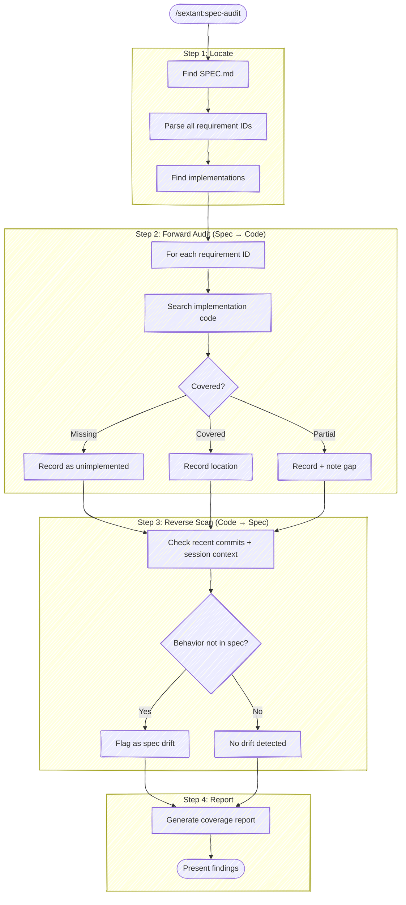

# Spec Audit

Check implementation coverage against SPEC.md — find gaps, drift, and unimplemented requirements.



## Step 1: Locate Spec and Implementations

Find the current SPEC.md. Check these locations in order:

1. `spec/` directory at the repo root or in common subfolder locations (`vnext/`, `exploration/`, `migration/`)
2. Check justfile for a `spec` variable pointing to the current version
3. Check environment for `CURRENT_SPEC_VERSION`
4. Look for SPEC.md at the repo root

If no SPEC.md is found, ask the user where it is.

Read the spec and extract **every** requirement ID (`[XX-NN]` format). Build a full inventory:

```text
Found N requirements across M categories:
  CM: CM-01, CM-02, CM-03
  OP: OP-01, OP-02
  ...
  FUT: FUT-01, FUT-02 (deferred — excluded from coverage)
```

Then locate all implementations. Check:

- `implementations/` directory (versioned: `implementations/<version>/<impl>/`)
- Any `STATUS.md` files that already track coverage
- The justfile `impl` or `current` variable for the active implementation

If a STATUS.md already exists, read it — it's a starting point, not the final answer. The audit verifies whether STATUS.md is accurate.

## Step 2: Forward Audit (Spec → Code)

This is the primary direction. For each non-FUT requirement ID in the spec:

1. **Read the requirement text** to understand what it specifies
2. **Search the implementation code** for evidence of coverage:
   - Grep for the requirement ID (e.g., `CM-01`) in comments or docs
   - Search for keywords and concepts from the requirement text
   - Read relevant source files to verify behavior matches the requirement
3. **Classify coverage:**
   - **Covered** — Implementation satisfies the requirement. Record the file(s) and line(s).
   - **Partial** — Some aspects implemented, others missing. Note what's covered and what's not.
   - **Missing** — No evidence of implementation. Flag it.
   - **Contradicts** — Implementation does something different from what the spec says. Flag with details.

Be thorough but practical — read the actual code, don't just grep for strings. A requirement about "sorting by date" might be implemented without ever mentioning the requirement ID.

## Step 3: Reverse Scan (Code → Spec)

This is harder and best-effort. Use available context to find behaviors not captured in the spec:

1. **Recent commits** — Check `git log` for the current branch and recent work. Look for features or behaviors that don't map to any requirement ID.
2. **Session context** — If there's conversation history about decisions made during implementation, check whether those decisions are reflected in the spec.
3. **STATUS.md notes** — Look for "spec problem" or "drift" annotations in existing STATUS.md files.
4. **Code exploration** — Scan the implementation for major features or behaviors. Do they all trace back to spec requirements?

Flag anything that looks like undocumented behavior — the implementation does something the spec doesn't mention. This is spec drift.

Don't try to be exhaustive here. The forward audit (Step 2) is authoritative. The reverse scan surfaces what it can from available signals.

## Step 4: Report

Present findings as a structured coverage report.

### Coverage Summary

```text
## Spec Audit: <project name>

**Spec:** <path to SPEC.md> (<version>)
**Implementation:** <path to implementation> (<name/stack>)
**Date:** <today>

### Coverage: N/M requirements (X%)

| Status      | Count | Requirements |
|-------------|-------|--------------|
| Covered     | N     | CM-01, CM-02, OP-01, ... |
| Partial     | N     | OP-03, BR-01, ... |
| Missing     | N     | LS-02, CM-04, ... |
| Contradicts | N     | OP-02, ... |
| Deferred    | N     | FUT-01, FUT-02, ... |
```

### Detailed Findings

For each non-covered requirement, provide:

```text
### [XX-NN] <requirement text (abbreviated)>
**Status:** Partial | Missing | Contradicts
**Evidence:** <what was found in code, or "none">
**Gap:** <specific description of what's missing or wrong>
```

### Spec Drift (Reverse Scan)

If any undocumented behaviors were found:

```text
### Spec Drift Detected

- **<behavior>** — Found in <file:line>. No matching requirement in spec.
  Suggest: Add as [XX-NN] or remove from implementation.
```

### STATUS.md Accuracy

If a STATUS.md existed before the audit, note any discrepancies:

```text
### STATUS.md Discrepancies

- [CM-03] marked as "covered" in STATUS.md but implementation is incomplete
- [OP-01] not in STATUS.md but fully implemented
```

### Recommendations

End with 1-3 prioritized next steps:

```text
### Recommended Next Steps

1. **Implement [XX-NN]** — <why this is highest priority>
2. **Clarify [YY-NN]** — <spec is ambiguous, implementation guessed>
3. **Update SPEC.md** — <spec drift needs to be captured or removed>
```

## Multiple Implementations

If multiple implementations exist, audit each one separately and then present a comparison:

```text
### Cross-Implementation Comparison

| Requirement | impl-1 (Python) | impl-2 (JS) | impl-3 (hybrid) |
|-------------|-----------------|--------------|------------------|
| CM-01       | Covered         | Covered      | Missing          |
| CM-02       | Covered         | Partial      | Covered          |
| OP-01       | Missing         | Missing      | Missing          |
```

Requirements missing from ALL implementations are strong signals of spec problems — the requirement may be unclear or impractical.

## When There Is No Implementation Yet

If no implementation exists, the audit is simpler: report the full requirement inventory, flag any ambiguous or contradictory requirements, and confirm the spec is ready for implementation. Check buy-vs-build candidates (STATUS.md for external tools) if they exist.

## Requirement Quality Check (EARS)

As part of every audit, scan requirement text for [EARS syntax](https://alistairmavin.com/ears) conformance. Requirements should use one of the five EARS patterns:

- **Ubiquitous** (no keyword): `The <system> shall <response>`
- **State-Driven** (`While`): `While <precondition>, the <system> shall <response>`
- **Event-Driven** (`When`): `When <trigger>, the <system> shall <response>`
- **Optional** (`Where`): `Where <feature is included>, the <system> shall <response>`
- **Unwanted Behaviour** (`If...then`): `If <condition>, then the <system> shall <response>`

Flag requirements that don't follow any EARS pattern as potentially ambiguous in the report:

```text
### Requirement Quality

N/M requirements follow EARS syntax.
Non-conforming:
- [XX-NN] "Logging should be configurable" — no EARS keyword; consider: "Where logging is enabled, the system shall write structured logs to stdout"
```

This is advisory, not blocking — some requirements may be intentionally informal during early spec drafts.

## Focused audits via ARGUMENTS

When the user invokes the skill with an argument that names a specific axis (e.g., `/sextant:spec-audit overly specific requirements`, `/sextant:spec-audit EARS conformance`, `/sextant:spec-audit deferred items only`), narrow the audit to that axis instead of running the full forward-and-reverse pass.

For axis-focused audits, skip the coverage matrix and produce only the section relevant to the axis. Keep the report short — under ~600 words — and order findings by severity. Suggest concrete rewrites for flagged items rather than just labeling them.

Common axes the skill should handle:

- **Overly specific requirements** — requirements that prescribe HOW (specific OSC sequences, file paths, library names, hardcoded numbers, internal function names) instead of WHAT. The contract is the user-observable behavior; mechanism belongs in implementation notes (typically a §6 in a beacon-style spec). For each flagged requirement, suggest a higher-level rewrite.
- **EARS conformance** — flag requirements that don't follow any EARS pattern.
- **Cross-requirement contradictions** — pairs of requirements that conflict.
- **Coverage of a sub-system** — when the user names a category prefix or section, audit only that scope.
- **Concept questions** — when the user asks `/sextant:spec-audit what does X mean?` (or `where is X used?`, `does X do anything?`), narrow to the concept and produce: (a) the definition with spec line references, (b) implementation pointers from a grep across the impl tree, (c) an explicit **orphaned-tracking** check — is the concept plumbed through state / overrides / hooks but never reaching any render surface (or output, API, side effect)? When the answer to (c) is "yes, fully tracked, no render surface" — that's load-bearing context for a removal decision. Don't recommend the removal; surface the finding and let the user decide.

When axis-focused audits are ideal use cases for delegation to a subagent: pass the spec path, the axis prompt, and a word budget, and let the subagent return findings while the main agent works on something else. This keeps the full spec text out of the main agent's context.
