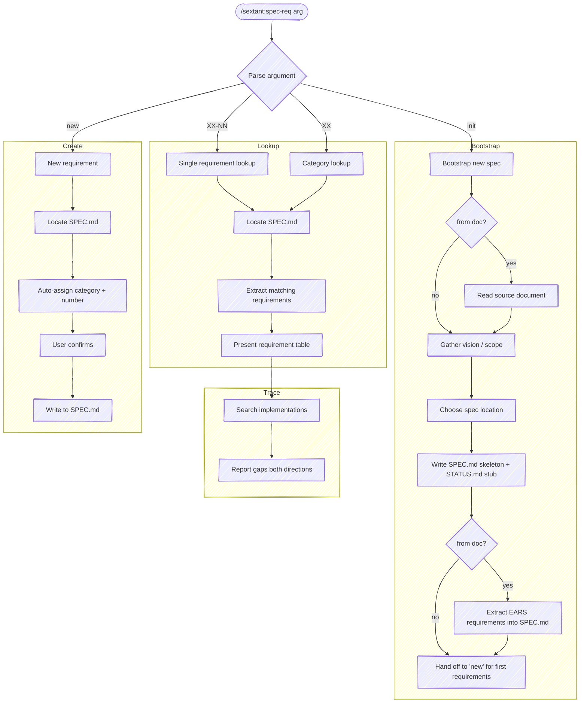

# Spec Req

Look up requirements by ID or category, trace them through implementations, and surface gaps in both directions. Also handles creating new requirements.



## Locate the spec

Find the current SPEC.md using the shared discovery order in
[`references/locate-spec.md`](../../references/locate-spec.md) (the source of
truth every sextant skill uses). In brief, first hit wins: STATUS.md
spec-pointer → `spec/` directory (incl. `vnext/`, `exploration/`, `migration/`)
→ justfile `spec` variable → `CURRENT_SPEC_VERSION` → root `SPEC.md` (or
`docs/spec.md`).

If no SPEC.md is found, ask the user where it is.

## Mode: Single requirement (`sextant:spec-req XX-NN`)

Look up one requirement by its full ID.

1. **Find the requirement** in SPEC.md. If the ID doesn't exist, say so and suggest nearby IDs in the same category.

2. **Present a table** with the requirement and its implementation status across all implementations:

```text
| ID    | Requirement              | impl-1       | impl-2       |
|-------|--------------------------|--------------|--------------|
| CM-01 | Config file loading      | Covered      | Partial      |
|       |                          | src/cfg.py:45| src/cfg.js:30|
```

3. **Trace through implementations** to find gaps:
   - **Implementation gaps** — the spec says something the code doesn't do. Search for the requirement ID in comments, grep for keywords from the requirement text, and read relevant code to verify behavior.
   - **Spec gaps** — the code around this requirement does something the spec doesn't mention. Look at neighboring code, recent commits touching related files, and STATUS.md notes.

4. **Report findings** below the table:

```text
Gaps found:
  → impl-2: missing env var override (CM-01 says "env vars take precedence")
  → Spec gap: impl-1 supports YAML config (src/cfg.py:62) but spec only mentions JSON
```

If no gaps are found, say so — a clean result is useful information.

## Mode: Category lookup (`sextant:spec-req XX`)

Look up all requirements in a category.

1. **Extract all requirements** matching the category prefix from SPEC.md.

2. **Present a summary table** with implementation status:

```text
## CM — Configuration (4 requirements)

| ID    | Requirement              | Status  | Location          |
|-------|--------------------------|---------|-------------------|
| CM-01 | Config file loading      | Covered | src/cfg.py:45     |
| CM-02 | Env var overrides        | Partial | src/cfg.py:72     |
| CM-03 | Validation on startup    | Missing | —                 |
| CM-04 | Config hot-reload        | FUT     | (deferred)        |
```

3. **Trace each non-FUT requirement** through implementations, same as single-requirement mode but summarized. Only report gaps — don't repeat "no gaps" for every covered requirement.

4. **Category summary** at the bottom:

```text
Coverage: 1/3 active requirements (33%)
Gaps: 2 implementation gaps, 1 spec gap
```

## Mode: New requirement (`sextant:spec-req new`)

Guide the user through creating a new requirement. This replaces the standalone `spec-new-req` skill.

### Step 1: Classify

Read existing categories and their highest requirement numbers from the spec.

Based on the user's description:
- **Match to an existing category** if it fits. Use the next available number.
- **Create a new category** if none fits. Choose a 2-3 letter mnemonic that doesn't collide with existing prefixes.
- **Draft the requirement text in EARS syntax** — choose the pattern that fits the requirement's activation. The five patterns (Ubiquitous, State-Driven, Event-Driven, Optional, Unwanted Behaviour) and how they combine live in [`references/ears-patterns.md`](../../references/ears-patterns.md).

Present for confirmation:

```text
Proposed requirement:

  [XX-NN] <drafted requirement text>
  Category: <name> (existing|new)

Does this look right?
```

### Step 2: Scope check

After the user confirms:

- **Trivial/isolated** — ask: "This looks straightforward — implement now, or capture for later?"
- **Non-trivial** — ask: "This touches [scope]. Implement now, or capture as `FUT-NN`?"

### Step 3: Write

**If implementing now:**
1. Add to SPEC.md in the appropriate category section, sorted by ID
2. Update STATUS.md with "Missing" for each tracked implementation (the shared Covered/Partial/Missing/Contradicts vocabulary)
3. Flow to implementations — make the change, update STATUS.md to "Covered"

**If capturing as future:**
1. Add to SPEC.md under "Future Requirements" as `[FUT-NN] (→ XX) <requirement text>`

**Confirm:**

```text
Captured [XX-NN]: <short description>
  → SPEC.md updated
  → STATUS.md updated (if applicable)
  → N implementations updated (if applicable)
```

## Mode: Bootstrap a new spec (`sextant:spec-req init [from <doc>]`)

Stand up a spec-driven repo from scratch — there's no SPEC.md yet. This is the
zeroth authoring step: once the skeleton exists, every other mode (and the rest
of sextant — `spec-sync`, `spec-status`, `impl-new`) operates on it.

Two variants:

- **`init`** (no source) — gather vision conversationally and scaffold an empty
  skeleton; requirements come next via `new`.
- **`init from <doc>`** — treat `<doc>` (a path or URL to a PRD, design doc,
  README, RFC, …) as a **requirements source**: derive vision and concepts from
  it, then extract its requirements into SPEC.md as EARS statements. The result
  is a populated spec, not an empty skeleton.

The steps below are shared; the `from <doc>` additions are called out inline.

### Step 1: Confirm there's no spec already

Run the locate order from the top of this skill. If a spec already exists,
**stop** and say so — `init` is for fresh repos; use `new` to add requirements
to an existing spec.

### Step 2: Gather vision and scope

**With `from <doc>`:** read the source first (Read for a path, WebFetch for a
URL), then derive the vision, key concepts, and candidate requirement
categories from its content instead of asking. Confirm the derived contract and
category set with the user in one pass rather than interviewing field by field —
they can correct the draft. Keep the document open; Step 4b extracts
requirements from it.

**Without a source — ask for:**

- **What the project does** — the one- or two-sentence contract. This becomes
  the spec's opening line.
- **Key concepts/nouns** the spec will reference — these seed the Concepts
  section so requirement text has defined terms to lean on.
- **Anticipated requirement categories** (config, CLI, rendering, …) — used to
  seed empty category sections with 2-3 letter mnemonic prefixes. Don't force
  this; a single starter category is fine, and more get added via `new`.
- **Whether multiple implementations are expected** — informs the spec
  location in Step 3.

### Step 3: Choose the spec location

Per the standard locate order:

- **Root `SPEC.md`** — simplest; for a single-implementation repo or an
  existing project adopting spec-driven in place.
- **`spec/<version>/SPEC.md`** (e.g. `spec/v1/SPEC.md`) — the versioned layout;
  pairs with an `implementations/<version>/` tree when you expect to explore
  multiple candidates. Record the version in the justfile `spec` variable so
  the other skills resolve it.

Ask which; default to root `SPEC.md` unless the user expects multiple
implementations.

### Step 4: Scaffold

Write the SPEC.md skeleton — an EARS preamble, a Concepts section, and empty
categorized requirement sections (no requirements yet):

```markdown
# <project> — Specification

<one- or two-sentence contract from Step 2>

Requirements use [EARS syntax](https://alistairmavin.com/ears) — each is one of:
Ubiquitous (`The <system> shall …`), State-Driven (`While …`), Event-Driven
(`When …`), Optional (`Where …`), or Unwanted Behaviour (`If … then …`).

## Concepts

- **<term>** — <definition>

## Requirements

### <PREFIX> — <category name>

_(none yet — add with `/sextant:spec-req new`)_
```

Then write a `STATUS.md` stub in the canonical shape that `spec-status`
maintains (zero requirements so far), and — if the versioned layout was chosen
— note the `implementations/<version>/` convention, or document that the repo
starts with a single root implementation.

**Without a source: do not invent requirements during `init`.** The skeleton is
empty by design; requirements come next via `new`. (This restriction is lifted
for `from <doc>`, where the document *is* the requirements source — see below.)

### Step 4b: Populate from the source document (`from <doc>` only)

When a source document was passed, the category sections are not left empty —
extract the document's requirements into them:

1. **Extract candidate requirements** from the document read in Step 2. Capture
   every distinct behavior, constraint, or rule it states — favor coverage; the
   user prunes in confirmation.
2. **Classify and number** each candidate into the categories from Step 2 (the
   same classification logic as `new` Step 1: match an existing category or mint
   a 2-3 letter mnemonic, assign the next number per category).
3. **Draft each in [EARS syntax](https://alistairmavin.com/ears)** — pick the
   pattern that fits the requirement's activation (Ubiquitous, State-Driven,
   Event-Driven, Optional, Unwanted Behaviour), exactly as in `new` Step 1.
4. **Present the full extracted set for confirmation** as a table grouped by
   category, so the user can correct wording, drop noise, or re-bucket before
   anything lands:

```text
Extracted N requirements from <doc>:

### CM — Configuration
  [CM-01] When the CLI starts, the system shall load config from <path>.
  [CM-02] If a required key is missing, then the system shall exit non-zero.

### RN — Rendering
  [RN-01] The system shall render output as <format>.

Confirm, edit, or drop any before I write them.
```

5. **Bulk-write the confirmed set** into SPEC.md under their category sections,
   sorted by ID, replacing the `_(none yet …)_` placeholders. Seed STATUS.md
   accordingly (every requirement starts uncovered, since no implementation
   exists yet). Note in your summary that these requirements are *derived from*
   the document and should be reviewed against it — extraction is a draft, not
   an authority.

### Step 5: Hand off

Report what was scaffolded.

**Without a source** — flow into `new` for the first real requirement:

```text
Scaffolded:
  → SPEC.md (EARS preamble, Concepts, N empty category sections)
  → STATUS.md stub
  → spec location: <root SPEC.md | spec/v1/SPEC.md, justfile spec=v1>

Next: add your first requirement — /sextant:spec-req new
```

**With `from <doc>`** — report the populated spec:

```text
Scaffolded from <doc>:
  → SPEC.md (EARS preamble, Concepts, N requirements across M categories)
  → STATUS.md (N requirements, all uncovered)
  → spec location: <root SPEC.md | spec/v1/SPEC.md, justfile spec=v1>

Review the extracted requirements against the source, then start an
implementation — /sextant:impl-new — or refine with /sextant:spec-req new.
```

## Multiple implementations

When multiple implementations exist, always show status per implementation in the table columns rather than a single status. This is where spec-driven development gets its value — disagreements between implementations often reveal spec ambiguities.
