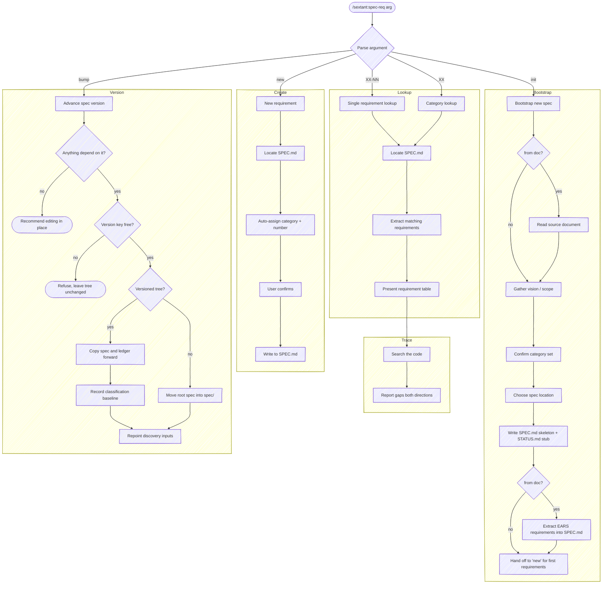

# Spec Req

Look up requirements by ID or category, trace them through the code, and surface gaps in both directions. Also handles creating new requirements.


```mermaid
%%{ init: { 'look': 'handDrawn' } }%%
flowchart TD
    Start(["/sextant:spec-req arg"]) --> Parse

    Parse{"Parse argument"} -->|"XX-NN"| Single["Single requirement lookup"]
    Parse -->|"XX"| Category["Category lookup"]
    Parse -->|"new"| New["New requirement"]
    Parse -->|"init"| Init["Bootstrap new spec"]
    Parse -->|"bump"| Bump["Advance spec version"]

    subgraph "Bootstrap"
        Init --> HasDoc{"from doc?"}
        HasDoc -->|"no"| Vision["Gather vision / scope"]
        HasDoc -->|"yes"| ReadDoc["Read source document"]
        ReadDoc --> Vision
        Vision --> Sections["Confirm category set"]
        Sections --> Location["Choose spec location"]
        Location --> Scaffold["Write SPEC.md skeleton + STATUS.md stub"]
        Scaffold --> FromDoc{"from doc?"}
        FromDoc -->|"yes"| Populate["Extract EARS requirements into SPEC.md"]
        FromDoc -->|"no"| Handoff["Hand off to 'new' for first requirements"]
        Populate --> Handoff
    end

    subgraph "Lookup"
        Single --> FindSpec["Locate SPEC.md"]
        Category --> FindSpec
        FindSpec --> Extract["Extract matching requirements"]
        Extract --> Table["Present requirement table"]
    end

    subgraph "Trace"
        Table --> Search["Search the code"]
        Search --> Gaps["Report gaps both directions"]
    end

    subgraph "Create"
        New --> FindSpec2["Locate SPEC.md"]
        FindSpec2 --> Classify["Auto-assign category + number"]
        Classify --> Confirm["User confirms"]
        Confirm --> Write["Write to SPEC.md"]
    end

    subgraph "Version"
        Bump --> Protect{"Anything depend on it?"}
        Protect -->|"no"| InPlace(["Recommend editing in place"])
        Protect -->|"yes"| KeyFree{"Version key free?"}
        KeyFree -->|"no"| Refuse(["Refuse, leave tree unchanged"])
        KeyFree -->|"yes"| Versioned{"Versioned tree?"}
        Versioned -->|"no"| Adopt["Move root spec into spec/"]
        Versioned -->|"yes"| Copy["Copy spec and ledger forward"]
        Copy --> Baseline["Record classification baseline"]
        Baseline --> Repoint["Repoint discovery inputs"]
        Adopt --> Repoint
    end
```

## Locate the spec

Find the current SPEC.md using the shared discovery order in
[`references/locate-spec.md`](../../references/locate-spec.md) (the source of
truth every sextant skill uses). In brief, first hit wins: STATUS.md
spec-pointer → `spec/` directory (incl. `vnext/`, `exploration/`, `migration/`)
→ justfile `spec` variable → `CURRENT_SPEC_VERSION` → root `SPEC.md` (or
`docs/spec.md`).

If no SPEC.md is found, ask the user where it is.

## Spec layout

Requirements are laid out per
[`references/spec-layout.md`](../../references/spec-layout.md) (the source of
truth every sextant skill uses). In brief: a category is a heading whose text is
its backticked prefix with the full name beneath it, and each requirement is a
heading one level below whose text is its backticked ID — so `SPEC.md#locate-01`
links to one requirement. A spec predating that layout writes each requirement
as a `- **[XX-NN]** …` bullet; read that form too, and match whichever form the
file already uses when writing into it. Offer to convert such a spec to headings
as its own whole-file edit — never as a side effect of adding a requirement.

## Mode: Single requirement (`sextant:spec-req XX-NN`)

Look up one requirement by its full ID.

1. **Find the requirement** in SPEC.md. If the ID doesn't exist, say so and suggest nearby IDs in the same category.

2. **Present a table** with the requirement and its status against the code:

```text
| ID        | Requirement         | Status  | Location            |
|-----------|---------------------|---------|---------------------|
| CONFIG-01 | Config file loading | Covered | src/cfg.py (`load`) |
```

3. **Trace it through the code** to find gaps:
   - **Implementation gaps** — the spec says something the code doesn't do. Search for the requirement ID in comments, grep for keywords from the requirement text, and read relevant code to verify behavior.
   - **Spec gaps** — the code around this requirement does something the spec doesn't mention. Look at neighboring code, recent commits touching related files, and STATUS.md notes.

4. **Report findings** below the table:

```text
Gaps found:
  → missing env var override (CONFIG-01 says "env vars take precedence")
  → Spec gap: YAML config is supported (src/cfg.py, `load_yaml`) but the spec only mentions JSON
```

If no gaps are found, say so — a clean result is useful information.

## Mode: Category lookup (`sextant:spec-req XX`)

Look up all requirements in a category.

1. **Extract all requirements** matching the category prefix from SPEC.md.

2. **Present a summary table** with implementation status:

```text
## CONFIG — Configuration

| ID        | Requirement           | Status  | Location                 |
|-----------|-----------------------|---------|--------------------------|
| CONFIG-01 | Config file loading   | Covered | src/cfg.py (`load`)      |
| CONFIG-02 | Env var overrides     | Partial | src/cfg.py (`apply_env`) |
| CONFIG-03 | Validation on startup | Missing | —                        |
| CONFIG-04 | Config hot-reload     | FUT     | (deferred)               |
```

3. **Trace each non-FUT requirement** through the code, same as single-requirement mode but summarized. Only report gaps — don't repeat "no gaps" for every covered requirement.

4. **Category summary** at the bottom:

```text
Coverage: 1/3 active requirements (33%)
Gaps: 2 implementation gaps, 1 spec gap
```

## Mode: New requirement (`sextant:spec-req new`)

Guide the user through creating a new requirement. This replaces the standalone `spec-new-req` skill.

### Step 1: Classify

Read existing categories and their highest requirement numbers from the spec.

Based on the user's description:
- **Match to an existing category** if it fits. Use the next available number.
- **Create a new category** if none fits. A prefix is more than one character, all caps, and a single word with no punctuation — the name people already say for the thing, usually the whole word (`RENDER`, not `RN`) but the initialism where that's what they say (`UX`, `CI`, `CLI`). The authoritative form and the naming trade-offs are in [`references/category-prefix.md`](../../references/category-prefix.md).
- **Draft the requirement text in EARS syntax** — choose the pattern that fits the requirement's activation. The five patterns (Ubiquitous, State-Driven, Event-Driven, Optional, Unwanted Behaviour) and how they combine live in [`references/ears-patterns.md`](../../references/ears-patterns.md).

Present for confirmation:

```text
Proposed requirement:

  XX-NN  <drafted requirement text>
  Category: <name> (existing|new)

Does this look right?
```

### Step 2: Scope check

After the user confirms:

- **Trivial/isolated** — ask: "This looks straightforward — implement now, or capture for later?"
- **Non-trivial** — ask: "This touches [scope]. Implement now, or capture as `FUT-NN`?"

### Step 3: Write

**If implementing now:**
1. Add to SPEC.md in the appropriate category section, sorted by ID, as its own
   heading — the backticked ID, one level below the category heading, with the
   EARS statement beneath it:

   ```markdown
   #### `CONFIG-04`
   When a config key is missing, the system shall exit non-zero naming the key.
   ```

   A new category gets its own heading first — the backticked prefix, its full
   name on the next line. (Match the file instead if this spec still uses the
   inline `- **[XX-NN]**` form; see Spec layout above.)
2. Record it in STATUS.md as "Missing" (the shared Covered/Partial/Missing/Contradicts vocabulary)
3. Flow to the code — make the change, update STATUS.md to "Covered"

**If capturing as future:**
1. Add to SPEC.md under "Future Requirements" as a `FUT-NN` heading whose body
   names the category it targets:

   ```markdown
   ### `FUT-03`
   (→ CONFIG) Where a profile is selected, the system shall …
   ```

**Confirm:**

```text
Captured XX-NN: <short description>
  → SPEC.md updated (SPEC.md#xx-nn)
  → STATUS.md updated (if applicable)
```

## Mode: Bootstrap a new spec (`sextant:spec-req init [from <doc>]`)

Stand up a spec-driven repo from scratch — there's no SPEC.md yet. This is the
zeroth authoring step: once the skeleton exists, every other mode (and the rest
of sextant — `spec-sync`, `spec-status`) operates on it.

Two variants:

- **`init`** (no source) — gather vision conversationally and scaffold an empty
  skeleton; requirements come next via `new`.
- **`init from <doc>`** — treat `<doc>` (a path or URL to a PRD, design doc,
  README, RFC, …) as a **requirements source**: derive vision and concepts from
  it, then extract its requirements into SPEC.md as EARS statements. The result
  is a populated spec, not an empty skeleton.

The steps below are shared; the `from <doc>` additions are called out inline.

### Step 1: Confirm there's no spec already

Run the locate order from the top of this skill. If a spec already exists,
**stop** and say so — `init` is for fresh repos; use `new` to add requirements
to an existing spec.

### Step 2: Gather vision and scope

**With `from <doc>`:** read the source first (Read for a path, WebFetch for a
URL), then derive the vision, key concepts, and candidate requirement
categories from its content instead of asking. Confirm the derived contract in
one pass rather than interviewing field by field — they can correct the draft.
The category set still goes through Step 2b; a set derived from a document is a
draft, not the user's decision. Keep the document open; Step 4b extracts
requirements from it.

**Without a source — ask for:**

- **What the project does** — the one- or two-sentence contract. This becomes
  the spec's opening line.
- **Key concepts/nouns** the spec will reference — these seed the Concepts
  section so requirement text has defined terms to lean on.
- **Anticipated requirement categories** (config, CLI, rendering, …) — used to
  seed empty category sections. Don't force this; a single starter category is
  fine, and more get added via `new`.
- **Whether the spec will be versioned** — informs the spec location in Step 3.

### Step 2b: Walk the user through the category set

The categories are the one decision here that's expensive to revisit: the prefix
is baked into every ID, and renaming one later re-IDs its requirements and
stales every ledger row, audit entry, and code anchor that cites them. So
name them **with** the user before anything is written, rather than scaffolding
a set they'll correct later.

Draft the set from Step 2 (or, with `from <doc>`, from the document's own
structure) and walk it section by section — one row each, with the prefix, the
name, and one line on what belongs in it and what doesn't:

```text
Proposed sections:

  CONFIG — Configuration     loading, precedence, validation of settings
  CLI    — Command surface   flags, subcommands, exit codes
  RENDER — Output rendering  formats and templates the CLI emits

Prefixes are all-caps single words, more than one character
(references/category-prefix.md). Rename, split, merge, or drop any — and say
what's missing. Nothing is written until you're happy with this set.
```

Take the user through it explicitly: ask whether each section is one they'd
recognize six months from now, and whether any behavior they care about has no
section to land in. Iterate until they sign off. Apply the naming rule in
[`references/category-prefix.md`](../../references/category-prefix.md) to
anything they propose, and say so when a suggested prefix needs adjusting to
meet it — don't silently rewrite their word.

### Step 3: Choose the spec location

Per the standard locate order:

- **Root `SPEC.md`** — simplest, and the default; for a new project or an
  existing one adopting spec-driven in place.
- **`spec/<version>/SPEC.md`** (e.g. `spec/v1/SPEC.md`) — the versioned layout,
  for a spec expected to go through revisions worth keeping side by side.
  Record the version in the justfile `spec` variable so the other skills
  resolve it.

Ask which; default to root `SPEC.md`.

### Step 4: Scaffold

Write the SPEC.md skeleton — an EARS preamble, a Concepts section, and empty
categorized requirement sections (no requirements yet):

```markdown
# <project> — Specification

<one- or two-sentence contract from Step 2>

Requirements use [EARS syntax](https://alistairmavin.com/ears) — each is one of:
Ubiquitous (`The <system> shall …`), State-Driven (`While …`), Event-Driven
(`When …`), Optional (`Where …`), or Unwanted Behaviour (`If … then …`).

Each requirement is its own heading carrying a stable ID (`XX-NN`), one level
below its category's heading, so every requirement has a linkable anchor
(`SPEC.md#xx-nn`). Lettered decompositions (`XX-NNa`) each count as one.

## Concepts

- **<term>** — <definition>

## Requirements

### `<PREFIX>`
<category name>

_(none yet — add with `/sextant:spec-req new`)_

## Future Requirements

_(none yet)_
```

Then write a `STATUS.md` stub in the canonical shape that `spec-status`
maintains (zero requirements so far), recording the spec location it tracks.

**Without a source: do not invent requirements during `init`.** The skeleton is
empty by design; requirements come next via `new`. (This restriction is lifted
for `from <doc>`, where the document *is* the requirements source — see below.)

### Step 4b: Populate from the source document (`from <doc>` only)

When a source document was passed, the category sections are not left empty —
extract the document's requirements into them:

1. **Extract candidate requirements** from the document read in Step 2. Capture
   every distinct behavior, constraint, or rule it states — favor coverage; the
   user prunes in confirmation.
2. **Classify and number** each candidate into the categories confirmed in
   Step 2b (the same classification logic as `new` Step 1: match an existing
   category or mint a prefix per
   [`references/category-prefix.md`](../../references/category-prefix.md),
   assign the next number per category). A candidate that fits no confirmed
   category is a signal the set is incomplete — take the proposed new section
   back to the user rather than minting it silently.
3. **Draft each in [EARS syntax](https://alistairmavin.com/ears)** — pick the
   pattern that fits the requirement's activation (Ubiquitous, State-Driven,
   Event-Driven, Optional, Unwanted Behaviour), exactly as in `new` Step 1.
4. **Present the full extracted set for confirmation** as a table grouped by
   category, so the user can correct wording, drop noise, or re-bucket before
   anything lands:

```text
Extracted N requirements from <doc>:

CONFIG — Configuration
  CONFIG-01  When the CLI starts, the system shall load config from <path>.
  CONFIG-02  If a required key is missing, then the system shall exit non-zero.

RENDER — Rendering
  RENDER-01  The system shall render output as <format>.

Confirm, edit, or drop any before I write them.
```

5. **Bulk-write the confirmed set** into SPEC.md under their category sections,
   one ID heading each (per Spec layout above), sorted by ID, replacing the
   `_(none yet …)_` placeholders. Seed STATUS.md accordingly (every requirement
   starts uncovered, since no implementation exists yet). Note in your summary
   that these requirements are *derived from* the document and should be
   reviewed against it — extraction is a draft, not an authority.

### Step 5: Hand off

Report what was scaffolded.

**Without a source** — flow into `new` for the first real requirement:

```text
Scaffolded:
  → SPEC.md (EARS preamble, Concepts, N empty category sections)
  → STATUS.md stub
  → spec location: <root SPEC.md | spec/v1/SPEC.md, justfile spec=v1>

Next: add your first requirement — /sextant:spec-req new
```

**With `from <doc>`** — report the populated spec:

```text
Scaffolded from <doc>:
  → SPEC.md (EARS preamble, Concepts, N requirements across M categories)
  → STATUS.md (N requirements, all uncovered)
  → spec location: <root SPEC.md | spec/v1/SPEC.md, justfile spec=v1>

Review the extracted requirements against the source, then refine with
/sextant:spec-req new or start building against them.
```

## Mode: Advance the spec version (`sextant:spec-req bump <version>`)

Move a project from one spec version to the next: `spec/v1/` becomes the
archive and `spec/v2/` becomes what every skill resolves to. This is `init`'s
Step 3 decision made a second time, so it keeps that layout and that justfile
variable rather than inventing new ones.

### Step 1: Ask what the bump protects

Versioning costs a second spec directory to keep straight and a discovery order
with more than one legal answer. It pays only when something would break if the
current text changed underneath it — a shipped release measured against it, an
audit trail that would stop resolving, or readers outside the repo.

Put that question to the user before touching anything, and **recommend editing
in place when the answer is nothing**. A spec with no consumers absorbs a
breaking edit for free, and skipping the bump keeps the tree small.

On an in-place answer, stop here and point at `new`.

### Step 2: Refuse an occupied key

If `spec/<version>/` already exists, say so and stop, leaving the tree
untouched. Bumping onto an occupied key either clobbers an archive or merges
two versions into one directory, and neither is undone by re-running.

### Step 2b: When the spec is an unversioned root SPEC.md

If the locate order resolved to a root `SPEC.md` (or `docs/spec.md`) and no
`spec/` tree exists, the first bump has nothing to copy *from*. Adopt the
versioned layout instead: move the root `SPEC.md` and its `STATUS.md` into
`spec/<version>/`, then skip to Step 5.

This is a migration, not an archive-creating bump, and the report says so —
there is no prior version to leave behind, because no version key was ever
occupied. Git holds the pre-move history.

**Set no classification baseline.** The requirement text is byte-identical
across the move, so every row's reading still stands; a baseline pointing at a
file that no longer exists would demote the whole ledger for nothing
([`references/classification-baseline.md`](../../references/classification-baseline.md)).

A project that wants an archived copy of the current text bumps again once it
has revised the new version.

### Step 3: Copy the current version forward

Copy `spec/<current>/SPEC.md` to `spec/<new>/SPEC.md` verbatim, and **leave the
prior version unmodified** — its whole value is being exactly what shipped.

Requirement IDs carry across unchanged; a bump is not a renumbering.

### Step 4: Carry the ledger forward with a baseline

Copy the prior version's STATUS.md to the new version, and record the prior
version's SPEC.md as its **classification baseline** — one line in the metadata
block:

```markdown
**Classified against:** spec/v1/SPEC.md
```

Carrying forward rather than reseeding is about what an empty ledger throws
away: the audit history and the human-authored rationale, which is the part no
template reconstructs and the part `spec-status` is otherwise careful to
preserve on every refresh. A bump is a poor reason to lose it, since most
requirements cross one unchanged.

The baseline covers the gap that carrying forward opens. Every row in that
copied ledger was classified by reading the code against v1's text; right after
the bump the two versions are identical, so the rows are still honest, but the
moment a requirement is reworded in v2 its row becomes a claim nobody checked.
Naming the file makes that visible to a reader immediately, and tells the next
`spec-status` run which rows to demote. The rules live in
[`references/classification-baseline.md`](../../references/classification-baseline.md).

The prior version keeps its own ledger untouched.

### Step 5: Repoint discovery

Repoint every input the locate order consults that this skill can write
([`references/locate-spec.md`](../../references/locate-spec.md)):

- the **STATUS.md spec-pointer** — step 1, and the one that wins
- the **justfile `spec` variable**

`CURRENT_SPEC_VERSION` is an environment variable, so it cannot be written from
here. When it is set, report that it still names the prior version and that the
user has to update it — a stale env var outranks the justfile silently.

A half-repointed bump is worse than no bump: discovery lands on a spec nobody is
building against, and the locate order raises nothing.

### Step 6: Report what moved and what stayed

```text
Bumped v1 → v2:
  → created   spec/v2/SPEC.md (N requirements, copied from v1)
  → created   spec/v2/STATUS.md (carried from v1, classified against spec/v1/SPEC.md)
  → repointed STATUS.md spec-pointer, justfile spec=v2
  → archived  spec/v1/ (unmodified)

CURRENT_SPEC_VERSION is set to v1 in your environment — update it to v2.

Next: reword v2's requirements, then /sextant:spec-status — it demotes the ones
whose text you changed and leaves the rest.
```

Drop the `CURRENT_SPEC_VERSION` line when the variable isn't set.

On a Step 2b migration the report has no archive line and no baseline:

```text
Adopted the versioned layout at v1:
  → moved     SPEC.md → spec/v1/SPEC.md (N requirements, unchanged)
  → moved     STATUS.md → spec/v1/STATUS.md (classifications still stand)
  → repointed justfile spec=v1

Next: revise spec/v1/SPEC.md, or /sextant:spec-req bump v2 to archive it first.
```
