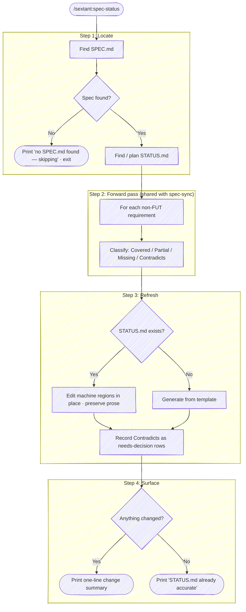

# Spec Status

Regenerate `STATUS.md` so its coverage numbers, category table, and version
match the current spec and code. Where `spec-sync` analyzes the full domain and
reconciles spec ↔ code, `spec-status` does only the lightweight ledger write —
it runs the same locate + forward pass, then edits the machine-derived regions
of STATUS.md in place while leaving human-authored prose untouched. Its small,
no-op-gated footprint is what makes it safe to wire into hooks and `/ship-it`.

It writes **only** STATUS.md. It never edits code or the spec. A requirement
whose code contradicts its spec text is a judgment call for the user, so it
lands in STATUS.md as an explicit needs-decision row rather than being silently
reconciled.



## Step 1: Locate the spec — and the no-op gate

Find the current SPEC.md using the same order as `spec-sync`:

1. If a `STATUS.md` already exists, read its spec-pointer link first (the
   header line, e.g. ``Tracking ... declared in [`docs/spec.md`](docs/spec.md)``).
   STATUS.md names where its own spec lives, and that pointer catches
   non-standard locations (e.g. beacon's lowercase `docs/spec.md`) the
   generic search below would miss.
2. `spec/` directory at the repo root or in common subfolders (`vnext/`,
   `exploration/`, `migration/`)
3. Justfile `spec` variable pointing to the current version
4. `CURRENT_SPEC_VERSION` environment variable
5. `SPEC.md` (or `docs/spec.md`) at the repo root

**No-op gate.** If no spec is found, print exactly one line and exit:

```text
no SPEC.md found — not a spec-driven repo, skipping
```

Do not ask where the spec is, do not scaffold anything, do not emit a report.
The silent no-op is what lets `/ship-it` call this skill unconditionally on
every release — non-spec repos self-skip with one quiet line. (`spec-sync`
asks the user when it can't find a spec; `spec-status` deliberately does not,
because it runs unattended inside other workflows.)

Once the spec is located, read it and extract every requirement ID
(`[XX-NN]` format), the same inventory `spec-sync` Step 1 builds. Note the
spec version (from the path `spec/<v>/`, the justfile `spec` var, or a version
line in the spec itself).

Then find the STATUS.md to refresh:

- **Single root `STATUS.md`** (the common case once a project has one
  implementation) — refresh it.
- **Per-implementation `STATUS.md`** under `implementations/<v>/<impl>/` (the
  pre-graduation `impl-new` layout) — refresh each one against its own
  declared scope.
- **No STATUS.md yet** (a fresh repo just scaffolded by `spec-req init`) —
  generate one from the template in Step 3.

## Step 2: Forward pass

Run the forward pass `spec-sync` runs (its Step 2) — this is the shared engine,
not a reimplementation. For each non-FUT requirement ID:

1. Read the requirement text.
2. Search the implementation for evidence (grep the ID, grep keywords, read
   the relevant source).
3. Classify: **Covered** (record file:line), **Partial** (note the gap),
   **Missing**, or **Contradicts** (code does something the spec doesn't say).

Read the actual code — don't classify from STATUS.md's existing rows. The
point of this skill is to catch the cases where STATUS.md and the code have
drifted apart, so the code is the authority, not the prior STATUS.md.

The reverse scan (`spec-sync` Step 2, code → spec) is optional here — surface
undocumented behavior if it's obvious, but `spec-status` is about coverage
accuracy, not exhaustive drift hunting. For a full drift sweep, the user runs
`spec-sync`.

## Step 3: Refresh STATUS.md

### When STATUS.md already exists — refresh in place

STATUS.md interleaves machine-derived facts with human-authored prose. Edit
the machine regions; leave everything else byte-for-byte.

**Regenerate (machine-derived):**

- The metadata block — `**Last audit:**` (today), `**Spec version:**`, any
  `**… version:**` / `**Plugin version:**` line, and the `**Coverage:**`
  count line (`N Covered, N Partial, N Missing/Contradicts` plus the deferred
  count).
- The `## Status by category` table — recompute each row's count and status
  column from the forward pass. Add a row for any category that appears in the
  spec but not the table; flag (don't delete) a table row whose category no
  longer exists in the spec.

**Counting rule** (this is where STATUS.md files drift most — get it exact):

- One normative requirement = one distinct `[XX-NN]` ID **including lettered
  decompositions** — `CL-21a`, `CL-21b`, … each count as one. A row labeled
  `CL-01..37 (+CL-19a)` whose real ID set includes `CL-21a..d` and `CL-36a..d`
  has a count of 46, not 38.
- **Exclude** from the normative count: FUT/deferred IDs and retired/struck IDs
  (removed from the spec, or shown struck-through). Retired IDs belong in the
  numbering-gap prose ("no PROV-04 … intentional"), never in the count.
- Enforce the invariant: the `**Coverage:**` header count == the sum of the
  table's per-row counts == the spec's normative inventory. The drift found in
  real repos was always one of these three disagreeing.

**Preserve (human-authored — never rewrite):**

- The intro pointer line and any prose context paragraph below the metadata
  block (the rationale that explains the coverage state).
- Numbering-gap notes ("no PROV-04, no CMD-10 … are intentional").
- The entire `## Audit history` section — append to it, never rewrite prior
  entries (see below).
- The `## How to use this file` boilerplate.

**Match the existing table's shape.** Some STATUS.md files use
`| Prefix | Covered | Status | Notes |`, others `| Prefix | Count | Status |
Notes |`. Preserve whichever columns the file already has rather than imposing
one. Keep requirement text in the Notes/row abbreviated — full text lives in
the spec.

This is a refresh, not a rewrite. Use targeted edits against the specific
fields and rows; do not regenerate the whole file from a template when one
already exists. That is what keeps the prose, the rationale, and the audit
history intact.

**Append a brief audit-history entry — only if something changed.** When the
refresh produced any edit, prepend a short factual entry under `## Audit
history` (after the heading, above the previous newest entry):

```text
### <today> — Coverage refresh (spec-status)

<the same one-line change summary printed in Step 4>
```

Keep it to the one-line summary plus, at most, a sentence naming the IDs that
moved. Do not fabricate the narrative depth of a hand-written audit entry —
those are the user's to write. If the refresh changed nothing, append nothing
(this is what makes a second consecutive run a clean no-op).

### When STATUS.md does not exist — generate from template

For a fresh repo (post `spec-req init`), write a new STATUS.md in the canonical
shape:

```markdown
# <project> — Spec Coverage Status

Tracking status of the requirements declared in [`<spec path>`](<spec path>).
Maintained by `/sextant:spec-status`.

**Last audit:** <today>
**Spec version:** <version>
**Coverage:** <N> Covered, <N> Partial, <N> Missing/Contradicts<, plus N deferred (FUT-…)>

## Status by category

| Prefix | Count | Status | Notes |
|--------|------:|--------|-------|
| XX-01..NN | <n> | <All Covered / mixed> | <evidence pointer> |

## How to use this file

When you implement a new requirement, change the row's status and add an
evidence pointer. When an audit reveals drift, update the row to **Partial**
or **Contradicts** with a one-line note.
```

Leave the context paragraph and `## Audit history` for the user to grow — a
generated file starts lean.

### Judgment-call mismatches — record, don't resolve

A **Contradicts** classification (the code does something the spec explicitly
says otherwise, e.g. a spec requiring "system monospace" against an
implementation shipping a bundled font) is the user's call to make. `spec-status`
never edits code or the spec to make them agree. Instead:

- Mark the row `Contradicts` (or `needs-decision`) in the category table with a
  one-line note stating the conflict.
- If there are any such items, add or update an `## Open / Needs Decision`
  section listing each: the requirement ID, what the spec says, what the code
  does, and that resolution (reword the spec, or change the code) is pending a
  human decision.

This keeps the contradiction visible and owned, rather than papered over.

## Step 4: Surface the change

End with a single line summarizing what the refresh did — the caller (a human,
or `/ship-it`) sees this without opening the file:

```text
STATUS.md updated: +6 IDs, 2 partials downgraded, version 0.9.0 → 0.20.0
```

Compose it from the actual delta between the old and new STATUS.md: IDs added,
status transitions (e.g. "2 Partial → Covered", "1 Covered → Contradicts"),
and any version/metadata change. If a needs-decision row was added, say so
(`… 1 needs-decision flagged`).

If nothing changed, print:

```text
STATUS.md already accurate — no changes
```

A second consecutive run must land here: the first run made STATUS.md match
the code, so the second finds nothing to do and writes nothing. Idempotency is
a correctness property of this skill — if a no-change run still produces a
diff, something in Step 3 is rewriting a region it should be preserving.

## Boundaries

- **Writes only STATUS.md.** Never edits source or SPEC.md — not to fix a
  Missing requirement, not to reconcile a Contradiction. Those are
  `spec-sync`'s job (or, for a single requirement, `spec-req` for the spec and
  an implementation session for the code).
- **Silent on non-spec repos.** The no-op gate prints one line and exits.
- **Refresh over rewrite.** Targeted edits to machine regions; human prose
  survives untouched.
- **Idempotent.** Running twice in a row leaves the second run with nothing to
  write.

## Related

- [`/sextant:spec-req`](../spec-req/SKILL.md) — when the refresh surfaces a
  Missing requirement that should be captured, or a Contradiction that should
  be resolved by rewording the spec.
- [`/sextant:spec-sync`](../spec-sync/SKILL.md) — the reconciler. Where
  `spec-status` records spec↔code divergence in the ledger, `spec-sync` acts on
  it: drafting requirements from drift (`--to-spec`) or surfacing the
  implementation gap list (`--to-source`). `spec-sync` delegates its ledger
  refresh back to this skill, so the two never duplicate the STATUS.md write.
- [`/sextant:spec-req`](../spec-req/SKILL.md) `init` — scaffolds the SPEC.md +
  STATUS.md stub that this skill then keeps fresh.
