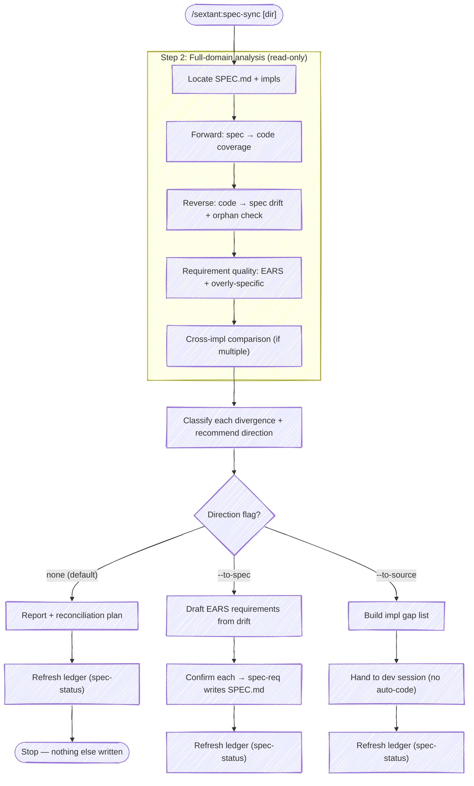

# Spec Sync

The single skill for understanding and reconciling the relationship between
SPEC.md and the implementation. Every run analyzes the **full domain** — all
requirements against all code, in both directions, plus requirement-quality
checks — and reports where the contract and the code agree, diverge, or drift.

By default it analyzes and proposes; it writes nothing but the coverage ledger
(`STATUS.md`). When you name a direction, it applies that resolution:

- **`--to-spec`** (source → spec): the code does something the spec doesn't
  capture. The skill drafts an EARS requirement and routes it through
  `spec-req` for your confirmation — it proposes, it does not canonize code
  into the contract silently.
- **`--to-source`** (spec → code): the spec requires something the code doesn't
  do. Writing that code is *implementation* — design, tests, review — not a
  mechanical sync. The skill produces the gap list and hands off to a
  development session. It never silently writes code to match a sentence.

Only the **ledger** is ever written without a judgment call, and that write is
delegated to [`spec-status`](../spec-status/SKILL.md) so the two skills never
duplicate it.



## Step 1: Locate spec and implementations

Find the current SPEC.md using the shared discovery order in
[`references/locate-spec.md`](../../references/locate-spec.md) (that file is the
source of truth). In brief, first hit wins: STATUS.md spec-pointer → `spec/`
directory (incl. `vnext/`, `exploration/`, `migration/`) → justfile `spec`
variable → `CURRENT_SPEC_VERSION` → root `SPEC.md` (or `docs/spec.md`).

`spec-sync` is **always user-invoked and interactive** — it is not wired to
hooks or called from a release workflow like `/ship-it`. So if no spec is found, say so and point the
user at `spec-req init` rather than no-op'ing silently:

```text
No SPEC.md found. spec-sync reconciles a spec against code — there's no spec
here yet. Run /sextant:spec-req init to scaffold one.
```

Read the spec and extract **every** requirement ID (`[XX-NN]` format) into a
full inventory:

```text
Found N requirements across M categories:
  CM: CM-01, CM-02, CM-03
  OP: OP-01, OP-02
  ...
  FUT: FUT-01, FUT-02 (deferred — excluded from coverage)
```

**Counting rule.** Count per [`references/counting-rule.md`](../../references/counting-rule.md)
(the source of truth): one distinct `[XX-NN]` ID = one requirement, lettered
decompositions (`CL-21a`, …) each count as one, FUT/deferred and retired IDs
excluded. Getting this wrong is the most common STATUS.md drift, so the
inventory count must be exact before anything downstream relies on it.

Then locate the implementation(s): the repo root, a versioned
`implementations/<version>/<impl>/` tree, and any `STATUS.md` files that
already track coverage. A pre-existing STATUS.md is a starting point, not the
answer — the analysis verifies whether it's accurate.

## Step 2: Full-domain analysis

This is the read-only core. It runs in full on every invocation — there is no
narrowed-axis mode. (The analysis is the heavy part of the skill; for a large
spec it is a good candidate to delegate to a subagent — pass the spec path and
impl root, let it return the structured findings while the main agent works.)

### Forward — spec → code coverage

For each non-FUT requirement ID:

1. **Read the requirement text** to understand what it specifies.
2. **Search the implementation** for evidence — grep the ID in comments/docs,
   grep keywords from the requirement text, and read the relevant source to
   verify behavior. Read the actual code; a requirement about "sorting by date"
   may be implemented without ever naming the ID.
3. **Classify:**
   - **Covered** — implementation satisfies it. Record file(s) and line(s).
   - **Partial** — some aspects implemented, others missing. Note the gap.
   - **Missing** — no evidence of implementation.
   - **Contradicts** — implementation does something different from the spec.

### Reverse — code → spec drift + orphan check

Best-effort, from available signals:

1. **Recent commits** — `git log` for features/behaviors that don't map to any
   requirement ID.
2. **Session context** — decisions made during implementation that never made
   it into the spec.
3. **STATUS.md notes** — existing "spec problem" / "drift" annotations.
4. **Orphaned tracking** — a concept plumbed through state / overrides / hooks
   but never reaching any render surface, output, API, or side effect. When a
   concept is fully tracked but never surfaced, that's load-bearing context for
   a removal decision — surface the finding, don't recommend the removal.

Flag anything the code does that the spec doesn't mention as drift.

### Requirement quality — EARS + overly-specific

Scan every requirement's text (this needs only the spec, not the code):

**EARS conformance.** Requirements should use one of the five EARS patterns
(see [`references/ears-patterns.md`](../../references/ears-patterns.md)).
Flag non-conforming requirements with a suggested rewrite. Advisory, not
blocking — early drafts may be intentionally informal.

**Overly-specific.** Flag requirements that prescribe *how* (specific OSC
sequences, file paths, library names, hardcoded numbers, internal function
names) instead of *what*. The contract is user-observable behavior; mechanism
belongs in implementation notes. Suggest a higher-level rewrite for each.

### Cross-implementation comparison

When multiple implementations exist, classify each separately and present a
matrix:

```text
| Requirement | impl-1 (Python) | impl-2 (JS) | impl-3 (hybrid) |
|-------------|-----------------|-------------|-----------------|
| CM-01       | Covered         | Covered     | Missing         |
| OP-01       | Missing         | Missing     | Missing         |
```

A requirement missing from **all** implementations is a strong signal of a spec
problem — the requirement may be unclear or impractical.

### When there is no implementation yet

The analysis is simpler: report the full requirement inventory, run the
quality checks, flag ambiguous or contradictory requirements, and confirm the
spec is ready to build against.

### The report

Present findings as a structured report:

```text
## Spec ⇄ Code — <project> (spec <version>)

### Coverage: N/M requirements (X%)

| Status      | Count | Requirements            |
|-------------|-------|-------------------------|
| Covered     | N     | CM-01, CM-02, OP-01, …  |
| Partial     | N     | OP-03, BR-01, …         |
| Missing     | N     | LS-02, CM-04, …         |
| Contradicts | N     | OP-02, …                |
| Deferred    | N     | FUT-01, FUT-02, …       |

### Detailed findings
(for each non-Covered requirement: status, evidence, gap)

### Drift (code → spec)
(undocumented behavior; orphaned tracking)

### Requirement quality
(EARS non-conformance; overly-specific requirements; with suggested rewrites)
```

## Step 3: Classify each divergence by resolution direction

Map every non-aligned item to the direction that should fix it:

| Divergence | Resolution direction | What applying it means |
|------------|----------------------|------------------------|
| Spec requires X, code is **Missing** it | `--to-source` | implement X (dev work) |
| Spec requires X, code **Contradicts** (does Y) | needs a decision | reword the spec *or* fix the code — surface, don't pick |
| Code does Z, spec is **silent** (drift) | `--to-spec` | add a requirement for Z (or decide Z should be removed) |
| Spec is ambiguous and impls disagree | `--to-spec` | tighten the requirement text |

**Contradictions are never auto-resolved in either direction.** They are the
case where both artifacts make a claim and only a human can say which is right.
Surface each with both sides stated; let the user choose the direction.

## Step 4: Act on the direction

### Default (no flag) — analyze, propose, refresh the ledger

Present the report above plus a reconciliation plan grouped by direction:

```text
→ to-source (spec leads, code missing):  3 items
   [OP-04] retry-with-backoff — no implementation found
   [CM-05] config validation on startup — partial (src/cfg.ts:40, no error path)

→ to-spec (code leads, spec silent):  2 items
   src/export.ts:88 — CSV export; no requirement covers it

⚠ needs decision (contradiction):  1 item
   [UP-01] "system monospace" — code ships a bundled font (src/ui.css:12)

Recommended: run `spec-sync --to-spec` to capture the 2 drift items, then a
dev session for the 3 to-source gaps. Resolve [UP-01] by hand.
```

Then refresh the ledger (call `spec-status`) so STATUS.md records current
coverage and the open divergences, and **stop**. The ledger is the only thing
the default writes — it leaves the tracker correct without touching spec or
code.

### `--to-spec` — capture code into the contract

For each `--to-spec` drift item:

1. Draft a requirement in EARS syntax (the `spec-req new` patterns) describing
   the observed behavior.
2. Present it for confirmation — including the option to reject (the behavior
   might be a bug to *remove* rather than a feature to *document*).
3. On confirmation, write it to SPEC.md via `spec-req`'s create flow
   (auto-assigned category + number, sorted into the right section).

Never write a requirement the user hasn't confirmed. Capturing code wholesale
would canonize whatever the code happens to do — the opposite of spec-leads
development. The default *lean* is source → spec because code usually moves
faster than the spec; the confirmation gate keeps that lean from becoming
rubber-stamping. After writing, refresh the ledger via `spec-status`.

### `--to-source` — surface the implementation gap

`spec-sync` does not write code. For each `--to-source` item (Missing or
Partial requirements where the spec is authoritative), produce an actionable
gap list:

```text
Implementation gaps (spec → code):

  [OP-04] When a request fails transiently, the system shall retry with
          exponential backoff. → no implementation. Suggested home: src/http.ts
  [CM-05] config validation on startup → partial; missing the error path.
          src/cfg.ts:40
```

Then hand off to a development session seeded with this list — a
new-feature workflow (or a greenfield one for a fresh implementation). If your
setup has the recipe plugin, `/recipe new-feature` / `/recipe greenfield` are
those workflows; otherwise just start a normal dev session with the gap list.
The user (or a dev session) writes and tests the code; `spec-status` then flips
the rows to Covered on the next ledger refresh.

## Boundaries

- **Full-domain analysis, every run.** No narrowed-axis mode — you always get
  coverage + drift + quality across the whole spec and code.
- **Bidirectional detection, one-directional application.** The default detects
  both ways and writes only the ledger. Applying is always an explicit
  `--to-spec` or `--to-source`, confirmed per item.
- **Never auto-resolves a contradiction.** Both artifacts disagree; a human
  picks the winner.
- **Never silently writes code.** `--to-source` emits a gap list and hands to a
  dev session.
- **Never canonizes code without confirmation.** `--to-spec` drafts and asks
  before writing SPEC.md.
- **Delegates the ledger write.** STATUS.md is always refreshed through
  `spec-status`, never written directly here.

## Related

- [`/sextant:spec-status`](../spec-status/SKILL.md) — the lightweight ledger
  writer. `spec-sync` delegates every STATUS.md refresh to it. Use it on its
  own (or wired into `/ship-it`) for the automatable "just update the tracker"
  loop, where `spec-sync` is the deliberate, interactive deep look.
- [`/sextant:spec-req`](../spec-req/SKILL.md) — `--to-spec` routes drafted
  requirements through its create flow; also the place to look up or trace a
  single requirement. Its `init` mode is what to run first when there's no spec
  to reconcile against yet.
- [`/sextant:impl-new`](../impl-new/SKILL.md) — scaffolds a candidate whose
  seeded STATUS.md this skill's analysis reads against.
